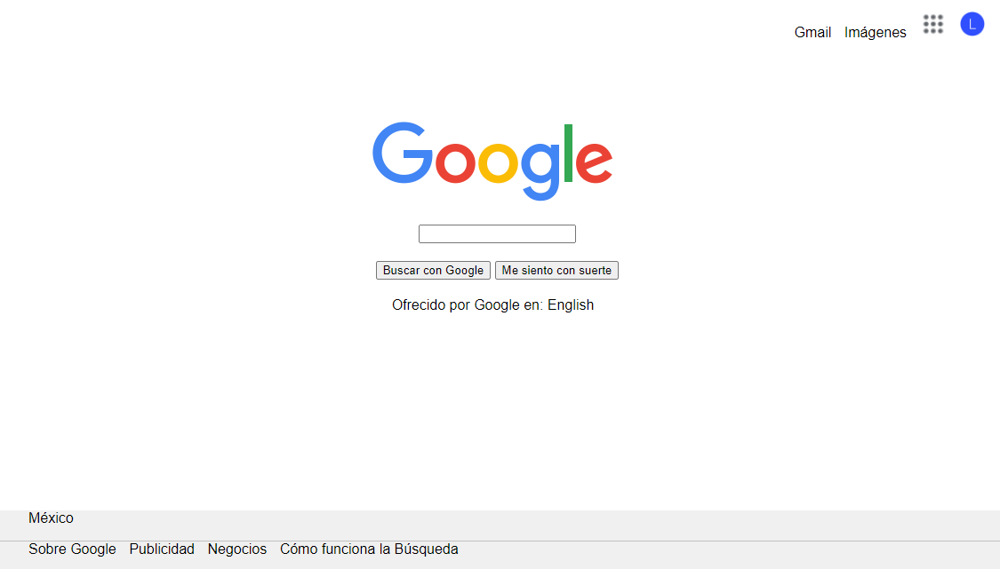
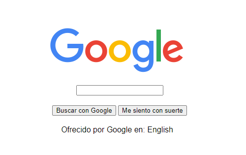
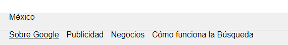

# CLON GOOGLE (sin usar Flexbox ni Grid)

El objetivo de este proyecto es realizar un clon de Google sin utilizar ningún layout como Grid o Flexbox tratando de asemejarse lo máximo posible a la página principal de Google.

Se maquetaron las 3 partes principales de la página:

* El body con el logo de Google, el input de busqueda y los botones.

  
* El header con los accesos a Gmail, Imágenes, Aplicaciones y Perfil.

  
* El footer con enlaces a otros sitios de google.

  
